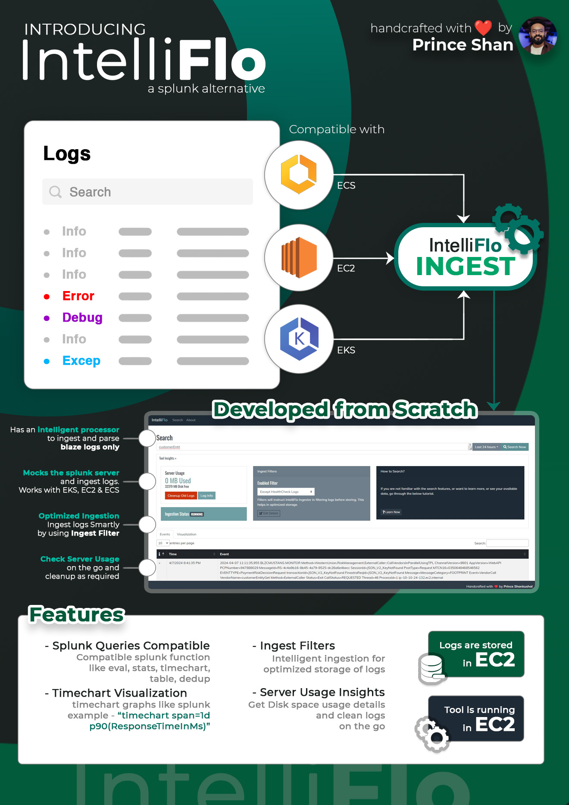

<div align="center">

# IntelliFlo

### A Splunk alternative, developed from scratch

Ingest, search and visualize your application logs from **AWS ECS, EC2 and EKS**, using the Splunk queries you already know, without the Splunk price tag.


*Handcrafted with ❤️ by **Prince Shankushal***

</div>

---



---

## Table of Contents

- [Why IntelliFlo?](#why-intelliflo)
- [Key Features](#key-features)
- [How It Works](#how-it-works)
- [Screenshots and UI Tour](#screenshots-and-ui-tour)
- [Getting Started](#getting-started)
- [How to Use](#how-to-use)
- [Supported Splunk Query Functions](#supported-splunk-query-functions)
- [Ingest Filters](#ingest-filters)
- [Server Usage Insights](#server-usage-insights)
- [Project Structure](#project-structure)
- [Roadmap](#roadmap)
- [Contributing](#contributing)
- [Author](#author)

---

## Why IntelliFlo?

Log search platforms are powerful but heavy and expensive. Many teams only need a fast way to **ingest, search and chart the logs of their own services**, and they already have muscle memory for Splunk's search language.

IntelliFlo was **built entirely from scratch** to fill that gap:

- **Familiar:** write the same Splunk-style queries you already use.
- **Drop-in:** it *mocks the Splunk server*, so your existing log shippers can send data to it with minimal change.
- **Cloud-native:** works with logs coming from **ECS, EC2 and EKS**.
- **Lean:** an intelligent processor plus ingest filters keep storage small and costs low.
- **Self-contained:** logs are stored on EC2 and the tool itself runs on EC2.

---

## Key Features

| Feature | What it gives you |
|---|---|
| **Splunk Queries Compatible** | Supports Splunk-style functions such as `eval`, `stats`, `timechart` and `dedup`. |
| **Timechart Visualization** | Splunk-like time-series charts, for example `timechart span=1d p90(ResponseTimeInMs)`. |
| **Ingest Filters** | Intelligent ingestion that filters logs *before* they are stored, for optimized storage (for example, exclude health-check logs). |
| **Server Usage Insights** | See disk space usage at a glance and clean up old logs on the go, as required. |
| **Intelligent Processor** | Ingests and parses **BlazeLogs only**, so unrelated noise stays out. |
| **Splunk Server Mock** | Mocks the Splunk server and ingests logs, working with **EKS, EC2 and ECS**. |
| **Search UI** | A clean web UI with a time-range picker, event table and visualization tab. |
| **Self-hosted on EC2** | Logs are stored on EC2 and the tool runs on EC2, so you own your data. |

---

## How It Works

```
 ┌──────────┐
 │   ECS    │───┐
 └──────────┘   │
 ┌──────────┐   │      ┌────────────────────────┐      ┌──────────────────┐
 │   EC2    │───┼────▶ │   IntelliFlo INGEST    │ ───▶ │  Log storage     │
 └──────────┘   │      │  (Splunk server mock + │      │  (on EC2)        │
 ┌──────────┐   │      │   intelligent processor│      └────────┬─────────┘
 │   EKS    │───┘      │   + ingest filters)    │               │
 └──────────┘          └────────────────────────┘               ▼
                                                      ┌──────────────────┐
                                                      │ IntelliFlo Search│
                                                      │ UI (queries,     │
                                                      │ timecharts, usage)│
                                                      └──────────────────┘
```

1. Your workloads on **ECS, EC2 or EKS** send logs to IntelliFlo, which presents itself like a Splunk server.
2. **IntelliFlo INGEST** parses the logs with its intelligent processor and applies your **Ingest Filters**.
3. Logs are stored on **EC2**.
4. You **search, chart and manage** them from the IntelliFlo web UI using Splunk-style queries.

---

## Screenshots and UI Tour

The **Search** page brings everything together:

- **Search bar and time range:** type a query and pick a window such as *Last 24 hours*, then click **Search Now**.
- **Tool Insights panel**
  - **Server Usage:** shows MB of logs used and disk space free, with **Cleanup Old Logs** and **Log Info** buttons.
  - **Ingest Filters:** shows the enabled filter (for example *Except HealthCheck Logs*), with an **Edit Details** option, and a live **Ingestion Status: RUNNING** indicator.
  - **How to Search?:** a built-in guide with a **Learn Now** tutorial for new users.
- **Events tab:** a paginated, searchable table of log events with their timestamps.
- **Visualization tab:** charts for your query results, such as timecharts.

---

## Getting Started

> **Note:** adjust the commands below to match your project's actual stack and entry points.

### Prerequisites

- An AWS EC2 instance to host IntelliFlo and its log storage
- Workloads on ECS, EC2 or EKS that can forward logs to a Splunk-compatible endpoint
- The runtime and SDK your build requires (see the project files)

### Clone

```bash
git clone <your-repo-url>
cd intelliflo
```

### Build and Run

```bash
# 1. Restore dependencies and build the project
#    (replace with your build command)

# 2. Configure your settings (storage path, ports, ingest filters)

# 3. Start IntelliFlo on your EC2 instance
#    (replace with your run command)
```

### Open the UI

Browse to `http://<your-ec2-host>:<port>/` and you will land on the **Search** page.

---

## How to Use

### 1. Point your logs at IntelliFlo

Configure your ECS, EC2 or EKS log forwarders to send to the IntelliFlo ingest endpoint. Because IntelliFlo mocks the Splunk server, you typically only need to change the target host and port.

### 2. Confirm ingestion is running

On the Search page, check **Ingestion Status** in the Tool Insights panel. It should read **RUNNING**.

### 3. Search your logs

1. Enter a query in the search bar.
2. Choose a time range (for example *Last 24 hours*).
3. Click **Search Now**.
4. Browse results on the **Events** tab.

### 4. Visualize

Use `timechart` to plot metrics over time, then switch to the **Visualization** tab:

```
timechart span=1d p90(ResponseTimeInMs)
```

### 5. Keep storage under control

- Use **Ingest Filters** to skip logs you never need.
- Check **Server Usage** regularly and use **Cleanup Old Logs** when disk space runs low.

---

## Supported Splunk Query Functions

| Function | Purpose |
|---|---|
| `eval` | Create or transform fields |
| `stats` | Aggregate results (count, sum, avg, percentiles and more) |
| `timechart` | Time-series charts, with `span=` and aggregate functions like `p90()` |
| `dedup` | Remove duplicate events |

Example, 90th percentile response time per day:

```
timechart span=1d p90(ResponseTimeInMs)
```

---

## Ingest Filters

Ingest Filters tell IntelliFlo's processor which logs to **drop before storage**, so your disk holds only what matters.

- Enable or disable filters from the **Ingest Filters** card.
- Example filter: **Except HealthCheck Logs**, which skips noisy load-balancer health checks.
- Result: smaller storage footprint, faster searches and lower cost.

---

## Server Usage Insights

The **Server Usage** card shows, on the go:

- How much space IntelliFlo's logs are using
- How much disk space is still free
- **Cleanup Old Logs:** reclaim space as required
- **Log Info:** details about what is stored

---

## Project Structure

> Update this section to reflect your repository layout.

```
intelliflo/
├── docs/
│   └── images/
│       └── intelliflo-overview.png   # overview graphic shown above
├── src/                              # application source
└── README.md
```

---

## Roadmap

- [ ] Support for more Splunk functions
- [ ] Saved searches and dashboards
- [ ] Alerting on query results
- [ ] Authentication and role-based access
- [ ] Retention policies with automatic cleanup

---

## Contributing

Contributions, ideas and bug reports are welcome.

1. Fork the repository
2. Create a feature branch: `git checkout -b feature/my-feature`
3. Commit your changes: `git commit -m "Add my feature"`
4. Push the branch: `git push origin feature/my-feature`
5. Open a Pull Request

---

## Author

**Prince Shankushal**
Creator and sole developer of IntelliFlo, built from scratch.
Developed in the year 2024

<div align="center">

*If IntelliFlo helps you, consider giving the repo a ⭐*

</div>
